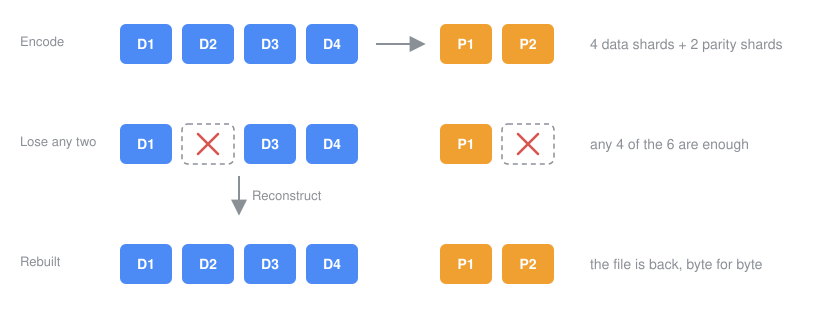
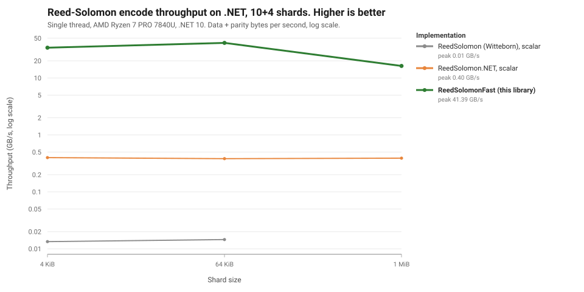

# ReedSolomonFast: Reed-Solomon erasure coding for .NET

A pure managed C# implementation of Reed-Solomon erasure coding over GF(2^8) for .NET. Uses hardware intrinsics (GFNI, AVX-512, AVX2, SSSE3, ARM NEON) for the field arithmetic, with automatic scalar fallback. Zero native dependencies, zero package dependencies, no P/Invoke.

Erasure coding turns N data shards into N + M shards such that any N of them rebuild the rest. It is the mechanism behind RAID-6 and beyond, object storage durability, backup splitting across drives or providers, and forward error correction over lossy links. This library brings it to C# / .NET as a single fully managed, Native AOT-friendly NuGet package that runs everywhere .NET runs.



[](https://www.nuget.org/packages/ReedSolomonFast)
[](https://www.nuget.org/packages/ReedSolomonFast)
[](https://github.com/Dissimilis/ReedSolomonFast/actions/workflows/ci.yml)
[](LICENSE)
[](https://buymeacoffee.com/dissimilis)

## Features

- **Pure managed C#** - no native libraries, no P/Invoke, no dependencies, runs everywhere .NET runs
- **Hardware accelerated** - GFNI multiplication at 256 or 512 bits, nibble-table shuffles on AVX-512, AVX2, SSSE3 and NEON, up to eight output accumulators on GFNI-512, automatic scalar fallback
- **Allocation control** - with array-backed buffers and the default single-threaded execution, `Encode` and `Verify` with caller scratch allocate nothing; reconstruction into caller buffers also avoids allocation when its decode plan is cached
- **Buffer overloads** - encode, verify and reconstruct support `byte[][]`, memory spans and contiguous stripes; incremental operations accept spans and memory buffers
- **Compatible parity** - the default matrix produces the same bytes as Backblaze JavaReedSolomon, klauspost/reedsolomon and reed-solomon-erasure, so shards move between systems
- **Full control when you want it** - Cauchy or custom matrices, kernel tier override, inversion cache, incremental `EncodeShard` and batched `EncodeShards`, parity `Update`, partial `ReconstructSome`, optional multithreading
- **Up to 256 shards** in any split of data and parity
- **Targets** `net10.0`

## How this compares to the other Reed-Solomon packages

[ReedSolomon.NET](https://github.com/egbakou/reedsolomon) by Laurent Egbakou and [ReedSolomon](https://github.com/Witteborn/ReedSolomon) by Witteborn are both ports of Backblaze's JavaReedSolomon. Their matrix construction and the shard layout here follow the same Backblaze design, and parity produced by either of them verifies with this library and the other way round.

The versions benchmarked below multiply one byte at a time through lookup tables. ReedSolomonFast uses SIMD field arithmetic with the kernel structure from Intel ISA-L. The encode table below measures about 40x to 110x the throughput of ReedSolomon.NET and 1,400x to 3,000x that of Witteborn's package on the same machine, single-threaded. See the numbers below.

Reed-Solomon repairs missing shards, not corrupted ones. `Verify` tells you whether parity matches data, but it cannot say which shard is wrong; keep a hash per shard if you need that.

## Installation

```
dotnet add package ReedSolomonFast
```

## Quick Start

To see the whole workflow on real files before writing code, run the [demo](src/ReedSolomonFast.Demo/README.md) from the root of a checkout, with the .NET 10 SDK installed: it splits three bundled samples into shards, deletes two of each six, rebuilds the files from disk and checks the bytes.

```text
dotnet run --project src/ReedSolomonFast.Demo -c Release
```

```csharp
using ReedSolomonFast;

// One coder per geometry; it is immutable and thread-safe, keep it around.
var rs = new ReedSolomon(dataShards: 10, parityShards: 4);

// Split a file into 10 data shards (last one zero-padded) plus 4 zeroed parity shards, then encode.
byte[] file = File.ReadAllBytes("archive.tar");
byte[][] shards = rs.Split(file);
rs.Encode(shards);                      // parity written into shards[10..13]

// Store the shards anywhere. Later, some are gone:
shards[2] = null!;
shards[7] = null!;
shards[12] = null!;

// Any 10 of the 14 rebuild the rest. Null entries are allocated and filled in place.
rs.Reconstruct(shards);
byte[] restored = rs.Join(shards, file.Length);   // Split does not store the length; you keep it

// Check parity without changing anything.
bool intact = rs.Verify(shards);

// Caller-buffer forms: present flags instead of nulls. Uncached decode plans allocate.
var present = Enumerable.Repeat(true, rs.TotalShards).ToArray();
foreach (int missing in new[] { 2, 7, 12 })
{
    present[missing] = false;                     // rebuild into the existing buffer
    shards[missing].AsSpan().Clear();
}
rs.Reconstruct(shards, present);
// Alternatives: rs.ReconstructData(shards, present) rebuilds only missing data;
// rs.TryReconstruct(shards, present) returns false if fewer than 10 shards are present.

// Padded buffers for a whole stripe; the memory overloads also accept pooled or sliced buffers.
Memory<byte>[] buffers = ReedSolomon.AllocateShards(rs.TotalShards, shards[0].Length);
for (int i = 0; i < rs.DataShards; i++)
    shards[i].AsSpan().CopyTo(buffers[i].Span);
ReadOnlyMemory<byte>[] data = buffers[..rs.DataShards]
    .Select(m => (ReadOnlyMemory<byte>)m).ToArray();
Memory<byte>[] parity = buffers[rs.DataShards..];
rs.Encode(data, parity);

// Incremental parity: zero the parity, feed data shards in any order, once each.
// Batch several contributions to reduce passes over parity.
foreach (var p in parity) p.Span.Clear();
rs.EncodeShards([0, 1, 2], data[..3], parity);
for (int i = 3; i < rs.DataShards; i++)
    rs.EncodeShard(i, data[i].Span, parity);

// Parity update after shard 3 changed, without touching the other nine.
byte[] oldShard3 = data[3].ToArray();
byte[] newShard3 = oldShard3.ToArray();
if (newShard3.Length > 0) newShard3[0] ^= 1;
rs.Update(changedIndices: [3], oldData: [oldShard3], newData: [newShard3], parity);
newShard3.AsSpan().CopyTo(buffers[3].Span);         // store the changed data alongside its updated parity

// Options, all optional.
var tuned = new ReedSolomon(10, 4, new ReedSolomonOptions
{
    Matrix = MatrixKind.Cauchy,             // default Vandermonde is byte-compatible with Backblaze/klauspost
    Kernel = KernelTier.Avx2,               // default: best supported; REEDSOLOMONFAST_KERNEL overrides per process
    MaxDegreeOfParallelism = -1,            // default 1 = never leaves your thread; -1 = all cores above the threshold
    ParallelThresholdBytes = 1 << 20,
    StreamingStores = false,               // opt-in non-temporal parity writes; benchmark encoding plus the consumer
    InversionCache = true,                  // remembers the inverted matrix per erasure pattern
});
Console.WriteLine(ReedSolomon.BestSupportedKernel);   // e.g. GfniAvx512

// Shards too large for memory: the same bytes, from and to streams, one 64 KiB window at a time.
// Data shard i is bytes [i * shardLength, (i + 1) * shardLength) of the zero-padded file, as Split
// lays it out; the caller supplies the padding. Every stream is read or written from its current
// position, so open fresh streams for each call. Nothing is sought, flushed or disposed.
long shardLength = (fileLength + rs.DataShards - 1) / rs.DataShards;
await ReedSolomonStreams.EncodeAsync(rs, dataStreams, parityStreams, shardLength);
Stream?[] inputs = OpenShards();  inputs[2] = null;                    // shard 2 is lost
Stream?[] outputs = new Stream?[rs.TotalShards]; outputs[2] = rebuilt; // ask for it back
await ReedSolomonStreams.ReconstructAsync(rs, inputs, outputs, shardLength);
bool ok = await ReedSolomonStreams.VerifyAsync(rs, OpenShards(), shardLength);   // all six, shard 2 restored
```

## Public API

| Type | Description |
|------|-------------|
| `ReedSolomon` | The coder. `Encode`, `EncodeShard`, `EncodeShards`, `Update`, `Verify`, `Reconstruct` / `ReconstructData` / `ReconstructSome` / `TryReconstruct`, `Split`, `Join`, `GetShardLength`, `GetPaddingLength`; static `AllocateShards`, `BestSupportedKernel`. Shards are data first then parity, all the same length; missing shards are null or empty entries (allocating forms) or a `present` flag span (caller buffers). Instances are immutable and thread-safe. |
| `ReedSolomonOptions` | `Matrix`, `CustomParityRows`, `InversionCache`, `InversionCacheSize`, `Kernel`, `MaxDegreeOfParallelism`, `ParallelThresholdBytes`, `StreamingStores`. Init-only; the defaults suit almost everyone. |
| `MatrixKind` | `Vandermonde` (Backblaze construction, the default) or `Cauchy`. |
| `KernelTier` | `Scalar`, `AdvSimd`, `Ssse3`, `Avx2`, `Avx512`, `GfniAvx2`, `GfniAvx512`. |
| `InsufficientShardsException` | Thrown by `Reconstruct` and `Join` when fewer shards are present than needed; carries `Present` and `Required`. Nothing is written when it is thrown. |
| `ReedSolomonStreams` | Static `EncodeAsync`, `ReconstructAsync`, `VerifyAsync` over `Stream`s, window by window, memory bounded by the window rather than the shard. Same bytes as the in-memory API. A completed call has read exactly `shardLength` bytes per participating input from its current position and written exactly that many per output; a short input throws `EndOfStreamException`, `VerifyAsync` stops at the first mismatch. Never seeks, pads, flushes or disposes. |
| `ReedSolomonStreamingOptions` | `WindowSizeBytes` (default 64 KiB per shard), `MaxConcurrentIoOperations` (default 4). |

## Performance

### Benchmarks

Encode and reconstruct against [ReedSolomon.NET](https://www.nuget.org/packages/ReedSolomon.NET) and [ReedSolomon](https://www.nuget.org/packages/ReedSolomon) (Witteborn). Every row is single-threaded; reconstruct rebuilds as many data shards as there are parity shards, the worst case. Throughput counts data plus parity bytes per operation, the convention klauspost uses.

```
BenchmarkDotNet v0.15.8, Windows 11 (10.0.26200)
AMD Ryzen 7 PRO 7840U w/ Radeon 780M Graphics, 1 CPU, 16 logical and 8 physical cores
.NET SDK 10.0.303, .NET 10.0.11, X64 RyuJIT AVX-512, kernel GfniAvx512
```

Mean time per encode, and the ratio against ReedSolomon.NET (lower is better):

| Shards | Shard size | ReedSolomon.NET | ReedSolomon (Witteborn) | **ReedSolomonFast** | Throughput |
|---|---:|---:|---:|---:|---:|
| 5+2 | 4 KiB | 38.4 us | 1.11 ms _(29.0)_ | **550 ns _(0.014)_** | 52.1 GB/s |
| 5+2 | 64 KiB | 597.7 us | 17.65 ms _(29.5)_ | **12.5 us _(0.021)_** | 36.8 GB/s |
| 5+2 | 1 MiB | 9.75 ms | not run | **166.5 us _(0.017)_** | 44.1 GB/s |
| 10+4 | 4 KiB | 143.3 us | 4.29 ms _(29.9)_ | **1.7 us _(0.012)_** | 34.0 GB/s |
| 10+4 | 64 KiB | 2.39 ms | 63.11 ms _(26.4)_ | **22.2 us _(0.009)_** | 41.4 GB/s |
| 10+4 | 1 MiB | 37.59 ms | not run | **901.4 us _(0.024)_** | 16.3 GB/s |
| 8+8 | 4 KiB | 239.0 us | 6.42 ms _(26.9)_ | **2.5 us _(0.010)_** | 26.1 GB/s |
| 8+8 | 64 KiB | 3.79 ms | 101.25 ms _(26.7)_ | **34.5 us _(0.009)_** | 30.4 GB/s |
| 8+8 | 1 MiB | 66.11 ms | not run | **1.05 ms _(0.016)_** | 16.0 GB/s |
| 50+20 | 4 KiB | 3.76 ms | 92.33 ms _(24.5)_ | **41.5 us _(0.011)_** | 6.9 GB/s |
| 50+20 | 64 KiB | 66.29 ms | 1.53 s _(23.1)_ | **734.3 us _(0.011)_** | 6.2 GB/s |
| 50+20 | 1 MiB | 1.09 s | not run | **23.91 ms _(0.022)_** | 3.1 GB/s |

Mean time per reconstruct:

| Shards | Shard size | ReedSolomon.NET | ReedSolomon (Witteborn) | **ReedSolomonFast** | Throughput |
|---|---:|---:|---:|---:|---:|
| 5+2 | 4 KiB | 40.7 us | 1.14 ms _(28.1)_ | **471 ns _(0.012)_** | 60.8 GB/s |
| 5+2 | 64 KiB | 1.18 ms | 17.58 ms _(14.9)_ | **5.7 us _(0.005)_** | 80.7 GB/s |
| 5+2 | 1 MiB | 18.79 ms | not run | **168.7 us _(0.009)_** | 43.5 GB/s |
| 10+4 | 4 KiB | 224.1 us | 3.89 ms _(17.4)_ | **1.6 us _(0.007)_** | 35.5 GB/s |
| 10+4 | 64 KiB | 4.62 ms | 66.56 ms _(14.4)_ | **21.6 us _(0.005)_** | 42.5 GB/s |
| 10+4 | 1 MiB | 81.29 ms | not run | **995.9 us _(0.012)_** | 14.7 GB/s |
| 8+8 | 4 KiB | 369.2 us | 7.07 ms _(19.1)_ | **2.3 us _(0.006)_** | 28.4 GB/s |
| 8+8 | 64 KiB | 7.74 ms | 114.73 ms _(14.8)_ | **38.7 us _(0.005)_** | 27.1 GB/s |
| 8+8 | 1 MiB | 116.48 ms | not run | **1.60 ms _(0.014)_** | 10.5 GB/s |
| 50+20 | 4 KiB | 5.25 ms | 94.28 ms _(17.9)_ | **38.0 us _(0.007)_** | 7.5 GB/s |
| 50+20 | 64 KiB | 80.54 ms | 1.58 s _(19.7)_ | **723.8 us _(0.009)_** | 6.3 GB/s |
| 50+20 | 1 MiB | 1.66 s | not run | **23.66 ms _(0.014)_** | 3.1 GB/s |



The Witteborn package was not run at 1 MiB: it copies every shard through `sbyte[]` on each call, and at 50+20 that is 100 MB of garbage per operation. These rows were measured with the maximum processor state pinned at 99% (turbo off), which keeps this laptop from throttling mid-run; the 1 MiB rows ran warm, and the ratios within a row are what to read. The benchmark project reproduces the table, gates every run on 51 million correctness checks first, and `make_chart.py` generates the chart from the same log.

### Hardware Intrinsics Tiering

The best tier the CPU supports is selected at construction; `ReedSolomonOptions.Kernel` or the `REEDSOLOMONFAST_KERNEL` environment variable pins one.

Encode throughput per tier from one `--tiers --report` run, 10+4 shards, single thread (data plus parity bytes per second):

| Tier | Instructions | 4 KiB shards | 64 KiB shards | 1 MiB shards |
|------|-------------|---:|---:|---:|
| **GFNI + AVX-512** | `VGF2P8AFFINEQB`, 512-bit | 26.7 GB/s | 21.7 GB/s | 12.1 GB/s |
| **GFNI + AVX2** | `VGF2P8AFFINEQB`, 256-bit | 22.0 GB/s | 23.8 GB/s | 10.6 GB/s |
| **AVX-512BW** | `VPSHUFB` nibble tables, 512-bit | 14.0 GB/s | 14.2 GB/s | 7.9 GB/s |
| **AVX2** | `VPSHUFB` nibble tables, 256-bit | 11.8 GB/s | 11.8 GB/s | 6.9 GB/s |
| **SSSE3** | `PSHUFB` nibble tables | 5.7 GB/s | 6.3 GB/s | 4.2 GB/s |
| **ARM NEON** | `TBL` nibble tables | not measured here | | |
| **Scalar** | 64 KiB multiplication table | 0.71 GB/s | 0.74 GB/s | 0.70 GB/s |

This run followed an hour of benchmarking on a throttling laptop, so every tier here is below the 41 GB/s the competitive table shows for the same shape; the ordering is what it measures, and the two GFNI tiers trade places by size.

Every vector tier runs the same engine: the byte range in 64 KiB chunks, inputs in balanced groups of at most twelve, and up to four output accumulators per pass over the inputs. GFNI-512 uses eight accumulators when all inputs fit in one group. Chunking and grouping bound the active streams and encourage cache reuse; whether the working set fits in L2 depends on the geometry and CPU.

### ARM64

The same suites on a Hetzner CAX11 (Ampere Altra, Neoverse N1, two shared vCPUs at 2.0 GHz, Ubuntu 24.04, .NET 10.0.11), single thread, NEON tier. Encode, mean time and ratio against ReedSolomon.NET:

| Shards | Shard size | ReedSolomon.NET | ReedSolomon (Witteborn) | **ReedSolomonFast** | Throughput |
|---|---:|---:|---:|---:|---:|
| 5+2 | 4 KiB | 74.5 us | 1.91 ms _(25.6)_ | **2.9 us _(0.040)_** | 9.7 GB/s |
| 5+2 | 64 KiB | 1.16 ms | 30.64 ms _(26.4)_ | **51.8 us _(0.045)_** | 8.8 GB/s |
| 10+4 | 4 KiB | 294.5 us | 6.99 ms _(23.8)_ | **10.4 us _(0.035)_** | 5.5 GB/s |
| 10+4 | 64 KiB | 4.73 ms | 109.61 ms _(23.2)_ | **178.8 us _(0.038)_** | 5.1 GB/s |
| 8+8 | 64 KiB | 7.54 ms | 173.64 ms _(23.0)_ | **290.9 us _(0.039)_** | 3.6 GB/s |
| 50+20 | 64 KiB | 123.00 ms | 2.66 s _(21.6)_ | **4.95 ms _(0.040)_** | 0.9 GB/s |

NEON is 10x the scalar tier and 20 to 30x ReedSolomon.NET on this core. klauspost measures 13 GB/s single-core on a dedicated 2.5 GHz Graviton2, the same Neoverse N1; 9.7 GB/s on a shared 2.0 GHz vCPU is the same class. Reconstruct is within 10% of encode on every row.

Two layout rules matter more than any option. First, batch small stripes: coding is independent per byte position, so if you have many 4 KiB stripes to encode, lay them out shard-major (each shard buffer holds the stripes back to back) and encode the whole buffers in one call. One call of sixteen 4 KiB stripes measured 18 to 36% faster than sixteen calls, on the same memory. Second, shard length: shards whose length is a power of two, allocated back to back, land on the same cache sets, and the kernel then fights the cache instead of using it. In the same run, 1 MiB + 1 byte shards encoded 26% faster than 1 MiB shards, at 8 MiB the padded layout from `AllocateShards` was 4x faster than plain arrays, and at 50+20 with 1 MiB shards it was 1.9x faster. Use `AllocateShards`, which spaces consecutive shards 256 bytes apart (a sweep found 256 better than one cache line and a whole page as bad as nothing), or give your shards a length that is not a power of two. And hand the coder whole shards rather than slicing a large payload into 64 KiB or 1 MiB windows: the kernel already walks shards in 64 KiB chunks, and windows measured 10 to 40% slower than one call over the same 16 MiB shards.

## Building from Source

```bash
# Requires .NET 10 SDK
dotnet build ReedSolomonFast.sln -c Release

# Run tests
dotnet test src/ReedSolomonFast.Tests -c Release

# Run benchmarks (A/B against the frozen baseline; --competitive, --tiers, --api for the other suites)
dotnet run --project src/ReedSolomonFast.Benchmarks -c Release

# Create NuGet package
dotnet pack src/ReedSolomonFast -c Release
```

## Acknowledgments

- [Backblaze JavaReedSolomon](https://github.com/Backblaze/JavaReedSolomon), for the systematic Vandermonde matrix construction that made shard compatibility across libraries possible
- [klauspost/reedsolomon](https://github.com/klauspost/reedsolomon) by Klaus Post, for the API verbs, the options, and the `Split`/`Join` padding rule this library follows
- [Intel ISA-L](https://github.com/intel/isa-l), for the `gf_Nvect_dot_prod` kernel structure and the table layout
- [ReedSolomon.NET](https://github.com/egbakou/reedsolomon) by Laurent Egbakou, the reference for byte-identical parity in the tests
